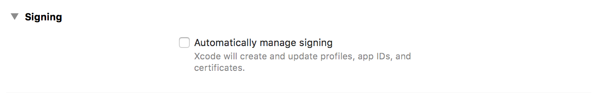
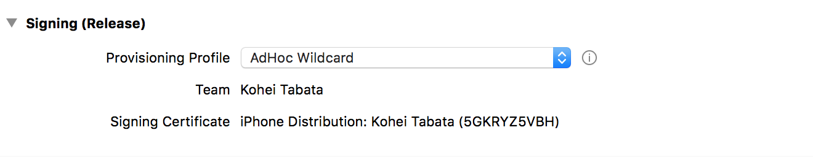
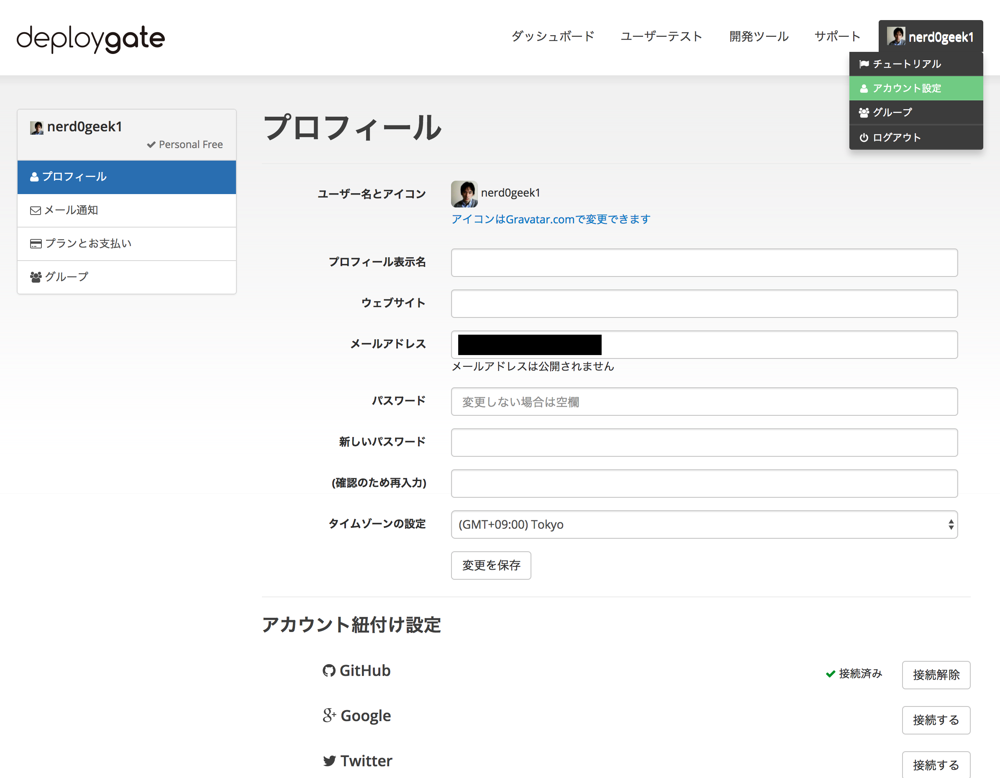

### ruby環境の構築(必要に応じて)
fastlaneを動かすruby環境を構築するために、rbenvを利用します。

```
$ brew install rbenv
$ brew install ruby-build
```

rbenvにパスを通すために、
`~/.bash_profile` に以下を追記します。

```
export PATH="$HOME/.rbenv/bin:$PATH"
eval "$(rbenv init -)"
```
`~/.bash_profile`を再読込し、  
rubyの2.3.1をインストール、  
それから、現在のディレクトリのrubyバージョンを2.3.1で指定します。
```
$ source ~/.bash_profile
$ rbenv install 2.3.1
$ rbenv local 2.3.1
```

### gemのインストール
今回必要なgemをGemfile.lockからインストールするために、  
Bundlerをインストールします。
```
$ gem install bundler
```

bunlderがインストールされたので、Gemfile.lockから
今回必要なgemをインストールします。

```
$ bundle install --path vendor/bundle
```

### gymコマンドの実行
サンプルプロジェクトの`Automatically manage signing`がオンになっているので、  
チェックを外し、自動署名をオフにします。  



`Signing(Release)`の`Provisioning Profile`に
AdHoc用のものを設定します。  
(WildcardのProvisioning Profileを用意しておくか、サンプルプロジェクトのBundle Identifierを既存アプリのものに書き換えると簡単です)  



gymコマンドを実行する用意ができたので、以下のコマンドを実行します。  
これで、ipaファイルの生成までが完了するはずです。  
(export_methodオプションはAdHoc用にビルドするため。デフォルトでは、AppStore用のビルドになる)

```
$ bundle exec fastlane gym --export_method "ad-hoc"
```

### Fastfileの作成、DeployGateでの配布
ここまででipaファイルの生成を自動化することができたので、  次にipaファイルの生成から配布までを自動化します。  
まず、以下のコマンドを実行し、fastlaneを利用するために必要なファイルを生成します。  
(以下のコマンドを実行すると、iOS Dev Center上に新しいアプリが作成されてしまうため、  
今回のハンズオンではあらかじめ用意したFastfileを使用します)

```
$ bundle exec fastlane init
```

次に、Fastfileに自分が行いたいタスク(fastlaneではlaneという)を定義します。  
今回は、DeployGateを利用したbeta版の配布ですので、betaと定義します。
```
default_platform :ios

platform :ios do
  desc "distribute latest app ipa via DeployGate"
  lane :beta do
  end
end
```

まずは、先程のipaファイル生成コマンドをFastfileに記述します。
```
desc "distribute latest app ipa via DeployGate"
lane :beta do
  gym(export_method: "ad-hoc")
end
```

次に、DeployGate配布用のコマンド(Action)を追記します。

```
DEPLOYGATE_API_TOKEN = ""
DEPLOYGATE_USER      = ""
desc "distribute latest app ipa via DeployGate"
lane :beta do
  gym(export_method: "ad-hoc")
  deploygate(api_token: DEPLOYGATE_API_TOKEN,
             user: DEPLOYGATE_USER,
             message: "fastlane study test message")
end
```

※ user, api_tokenはDeployGateのアカウント設定画面に表示されています。



Fastfileの編集を完了し、最後に以下のコマンドを実行することで、DeployGateを使用したアプリ配布が実行されます。
```
bundle exec fastlane beta
```
